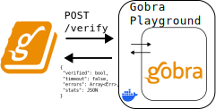

# Gobra Playground
[](https://github.com/gottschali/gobra-playground/actions/workflows/ci.yml)
[](https://github.com/gottschali/gobra-playground/actions/workflows/docker-image.yml)

Simple HTTP server to verify Go programs with the [Gobra](https://github.com/viperproject/gobra/pkgs/container/gobra) verifier.
- the Gobra playground exposes the `/verify` endpoint
- Gobra is run as a subprocess
- the results are parsed and returned as JSON



This is a companion project of the [Gobra Book](https://github.com/viperproject/gobra-book).
After 60 seconds there is a timeout to ensure that a request does not block the server indefinitely.
Please consider a different way to run Gobra for programs with longer verification time.

<!-- insert demo -->

## Deploying
A docker image is provided.
``` sh
IMAGE=ghcr.io/gottschali/gobra-playground:latest
docker pull $IMAGE
docker run -p 8090:8090 --rm $IMAGE
```

The playground uses the [latest Gobra version](https://github.com/viperproject/gobra/pkgs/container/gobra).


## Building and testing locally
To run the playground, you must have a `z3` [solver executable](https://github.com/Z3Prover/z3) on your path.
The environment variables `JAVA_EXE` and `GOBRA_JAR` must be set to a java executable and a Gobra jar respectively.

``` bash
> go build
> ./gobra-playground
Starting server on http://localhost:8090
```
We can submit a program:
``` bash
INPUT_FILE="./tests/basicAnnotations.gobra"
ENDPOINT="http://localhost:8090/verify"
file_contents=$(<"$INPUT_FILE")

curl "$ENDPOINT" \
    -X POST \
    -H 'Accept: application/json' \
    -H 'Content-Type: application/x-www-form-urlencoded; charset=UTF-8' \
    --data-urlencode "version=1.0" \
    --data-urlencode "body=$file_contents"
```
``` json
{
  "verified": true,
  "timeout": false,
  "errors": [],
  "duration": 4.107589551,
  "stats": ...
}
```

Run all tests with:
``` bash
go test -v ./... 
```
  
# License

The scripts and documentation in this project are released under the [Mozilla Public License 2.0](LICENSE.txt).
